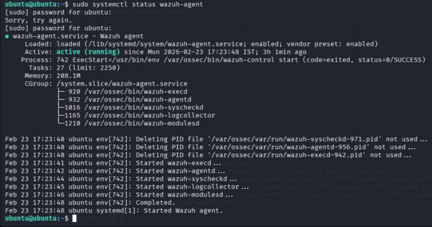
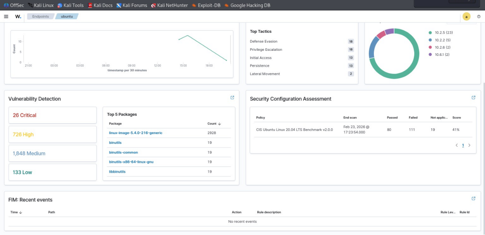
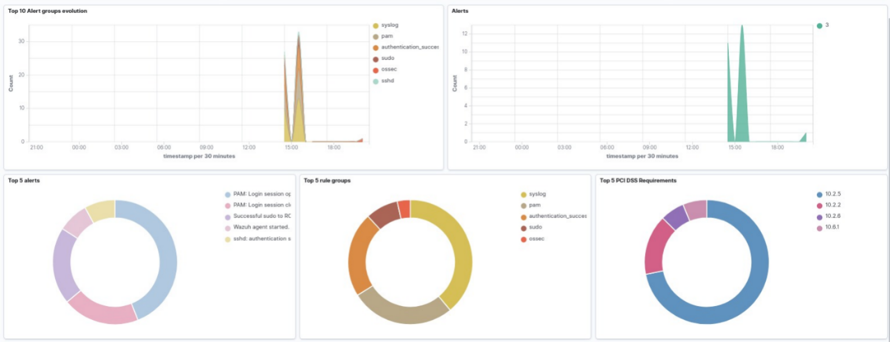

=> SIEM Validation

Purpose
The purpose of this phase is to verify that the Wazuh SIEM infrastructure is fully operational before beginning attack simulation.

This ensures logs can be collected, processed, and analyzed correctly, and that alerts will be generated when malicious activity occurs.

Validating SIEM functionality before testing is a standard best practice in real Security Operations Centers.

Wazuh Manager Service Validation
The Wazuh manager service was checked to confirm that it is running and healthy.

The manager is responsible for receiving logs from agents, analyzing events, and triggering alerts based on detection rules.

A successful service status confirms that the detection engine is active and ready to process incoming data.

=> Validation Result
The service status confirmed that the Wazuh manager is active and running without errors, indicating the SIEM backend is operational.

=> Agent Connectivity Validation
The Ubuntu machine was verified to ensure the Wazuh agent is running and successfully connected to the manager.

The agent is responsible for collecting system logs and forwarding them to the Wazuh server for analysis.

Successful connectivity confirms log ingestion is functioning properly.

=> Validation Result
The agent service was confirmed active and communicating with the manager, indicating successful endpoint monitoring.

=> End-to-End Log Flow Verification
To confirm full SIEM functionality, logs were verified to ensure they are being received and processed correctly.

This step validates the complete data pipeline from endpoint to SIEM dashboard.

=> SIEM Operational Status
The SIEM platform is fully operational with:

Active manager service
Connected endpoint agent
Functional log collection
Ready detection engine
The environment is now prepared for attack simulation and monitoring.

=> Troubleshooting Experience
During setup, several real-world issues were encountered and resolved, demonstrating practical troubleshooting skills.

Common issues included incorrect server configuration, permission errors, service timeouts, and agent registration conflicts.

Each issue was resolved by reviewing configuration files, correcting permissions, re-registering the agent, and synchronizing system time.

This experience reflects real operational challenges faced in SOC environments.

=> Evidence Collection
Screenshots were captured to provide proof of successful SIEM validation.

These include service status checks, agent connectivity confirmation, and operational verification.

=> Conclusion
Phase 2 confirms that the SIEM infrastructure is functioning correctly and ready to detect security events.

With monitoring validated, the lab can now safely proceed to attack surface discovery and vulnerability assessment.

=> WAZUH ADGENT STATUS on ubuntu

=> WAZUH MANAGER STATUS on wazuh

=> WAZUH DASHBOARD 

