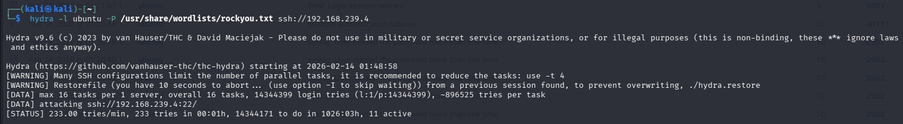
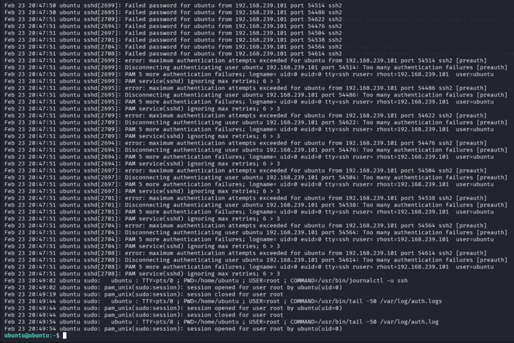

=> Attack Simulation — SSH Brute Force

Purpose
The purpose of this phase is to simulate a brute force attack against the SSH service running on the target system.

This simulation helps generate authentication failure logs that will later be analyzed by the SIEM platform to validate detection capabilities.

Brute force attacks are one of the most common real-world attack techniques used to gain unauthorized access.

=> Attack Overview
The attack was performed from the Kali Linux attacker machine targeting the Ubuntu server.

A password wordlist was used to simulate repeated login attempts against the SSH service to mimic attacker behavior.

This test was conducted in an isolated lab environment to ensure safe execution.

=> Target
The Ubuntu machine was selected as the target because it represents a monitored endpoint with SSH enabled.

=> Tool Used
Hydra was used as the attack tool.

Hydra is a popular password cracking utility capable of performing dictionary attacks against multiple protocols including SSH, FTP, HTTP, and more.

=> Attack Command
hydra -l ubuntu -P /usr/share/wordlists/rockyou.txt ssh://192.168.56.X
Command Explanation
hydra is the password brute force tool used for login attacks.

The username option specifies the target account used for authentication attempts.

The password list option provides a dictionary of potential passwords.

The SSH protocol target indicates the service being attacked.

=> Attack Execution
The tool initiated repeated login attempts using passwords from the wordlist.

Multiple authentication failures were observed, confirming that the attack successfully generated security events on the target system.

=> Expected Outcome
The attack generates failed login attempts in the authentication logs of the Ubuntu machine.

These logs will later be collected by the Wazuh agent and analyzed by the SIEM platform for detection.

=> Security Impact
Brute force attacks can lead to unauthorized access if weak credentials are used.

Monitoring and detecting these attacks is critical to preventing account compromise.

=> Evidence Collection
Screenshots of the Hydra execution output were captured to provide proof of attack simulation.

=> Conclusion
Phase 4 successfully simulated a brute force attack against the target system, generating authentication logs required for detection validation.

This confirms that the lab environment can simulate real attack scenarios.

=> HYDRA ATTACK SIMULATION

=> ATTACK LOG DETECTION 

=> VICTIM LOGS

=> VICTIM AUTH LOGS

