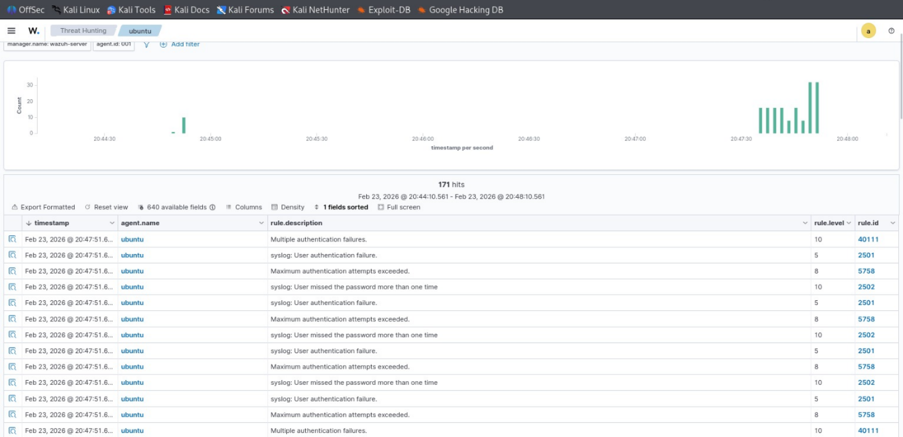
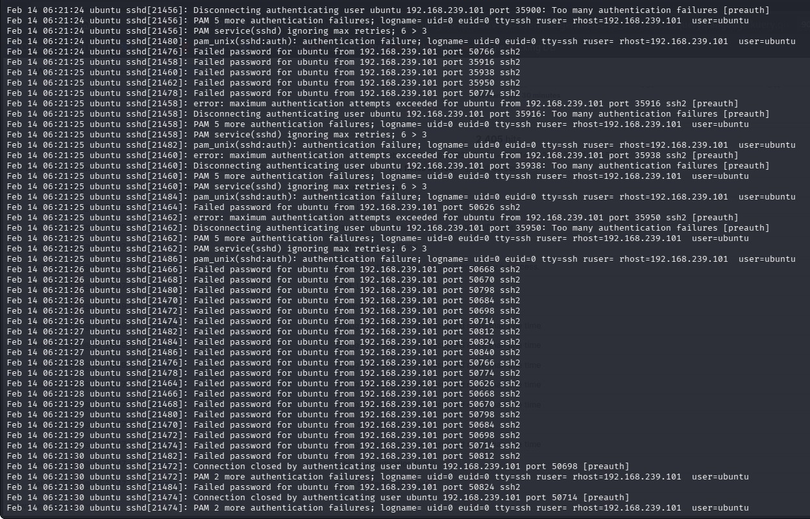

=> Log Collection — Authentication Monitoring
Purpose
The purpose of this phase is to monitor system authentication logs on the target machine to verify that the brute force attack generated security events.

Log monitoring is a critical step in security operations because it provides visibility into system activity and helps identify suspicious behavior.

=> Log Source
Authentication logs from the Ubuntu machine were monitored because they record login attempts, authentication failures, and security-related events.
These logs are essential for detecting brute force attacks and unauthorized access attempts.

=> Monitoring Method
Real-time log monitoring was performed using a command that continuously displays new log entries as they occur.

This allowed observation of authentication failures generated during the attack simulation.

=> Command Used
"sudo tail -f /var/log/auth.log"
=> Command Explanation
The command is used to monitor log files in real time.
Administrative privileges are required because authentication logs are restricted.
The command continuously displays new log entries as they are written to the file.

=> Observed Events
Multiple failed login attempts were observed during monitoring, confirming that the brute force attack generated authentication failure logs.
Each failed login attempt was recorded with timestamps, usernames, and source IP addresses.

=> Log Analysis
The logs indicate repeated authentication failures from the attacker machine, which is consistent with brute force attack behavior.

These events will be forwarded to the SIEM platform by the Wazuh agent for detection and alerting.

=> Security Relevance
Monitoring authentication logs helps detect unauthorized access attempts and credential-based attacks.
This visibility enables security teams to respond quickly to potential threats.

=> Evidence Collection
Screenshots of real-time log monitoring were captured to demonstrate log generation during attack simulation.

=> Conclusion
Phase 5 confirms that the attack successfully generated authentication logs on the target system.

This validates the log generation process required for SIEM detection in the next phase.

= LOGS VISUALIZATION 

=> LOGS

=> AGENT LOGS

=> AUTHENTICATION LOGS

=> AUTHENTICATION LOGS

