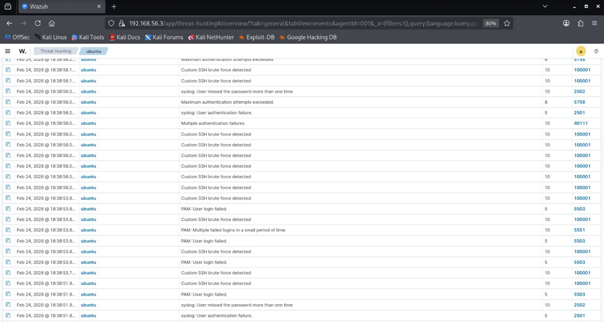
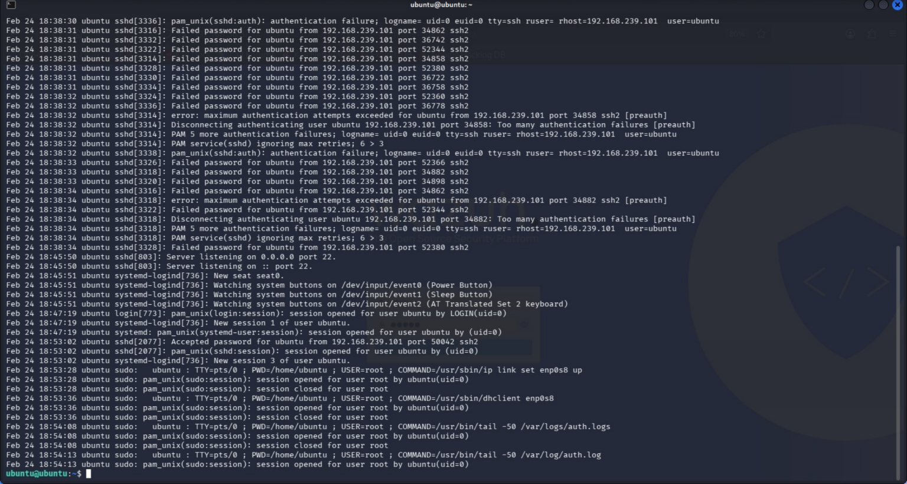
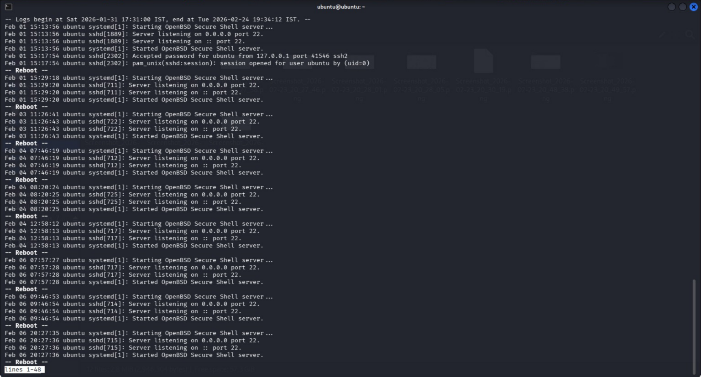

=> SIEM Detection — SSH Brute Force Alert Validation
Purpose
The purpose of this phase is to validate that the SIEM platform successfully detected the brute force attack performed in the previous phase.

This confirms that the log ingestion pipeline, detection rules, and alerting mechanisms are functioning correctly.

Detection validation is a critical step in security operations because it ensures that malicious activity is not only logged but also identified and escalated.

=> Detection Scenario
Following the SSH brute force simulation, authentication failure logs were forwarded from the Ubuntu endpoint to the Wazuh manager.
The SIEM platform analyzed these logs using built-in detection rules designed to identify repeated failed login attempts.

=> Detection Method
The Wazuh dashboard was used to search for alerts related to authentication failures generated during the attack simulation.
A targeted query was executed to filter events associated with the Ubuntu agent and the SSH brute force rule.

=> Query Used
agent.name: ubuntu AND rule.id: 5716
Query Explanation
The query filters alerts generated specifically from the Ubuntu endpoint.

The rule identifier corresponds to the Wazuh detection rule that triggers when multiple authentication failures occur within a short timeframe.
This allows precise identification of brute force activity.

=> Detection Results
The SIEM platform successfully generated alerts indicating multiple failed login attempts consistent with brute force attack behavior.
The alerts included timestamps, source IP address, targeted username, and severity level.
This confirms that the attack was detected and properly classified.

=> Alert Analysis
The alerts demonstrate repeated authentication failures originating from the attacker machine.
The detection rule triggered after multiple failed login attempts within a defined timeframe, indicating automated attack activity.

=> Security Significance
Early detection of brute force attacks allows security teams to respond before unauthorized access is achieved.
This capability is essential for preventing credential compromise and maintaining system integrity.

=> Evidence Collection
Screenshots of the Wazuh dashboard alerts were captured to provide proof of detection.
These screenshots demonstrate the SIEM’s ability to identify malicious activity in real time.

=> Conclusion
Phase 6 confirms that the SIEM platform successfully detected the simulated brute force attack.
This validates the effectiveness of log collection, correlation, and alert generation within the lab environment.
The environment is now ready for detection engineering and custom rule development.

=> DASHBOARD LOGS

=> VICTIM LOGS 

=> VICTIM LOGS

